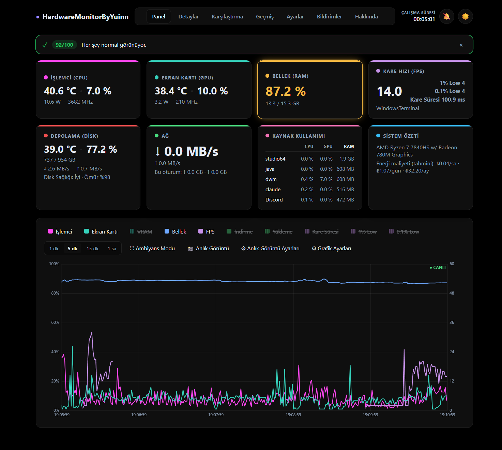
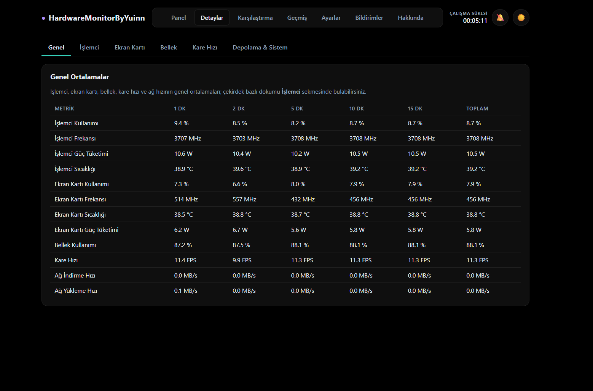
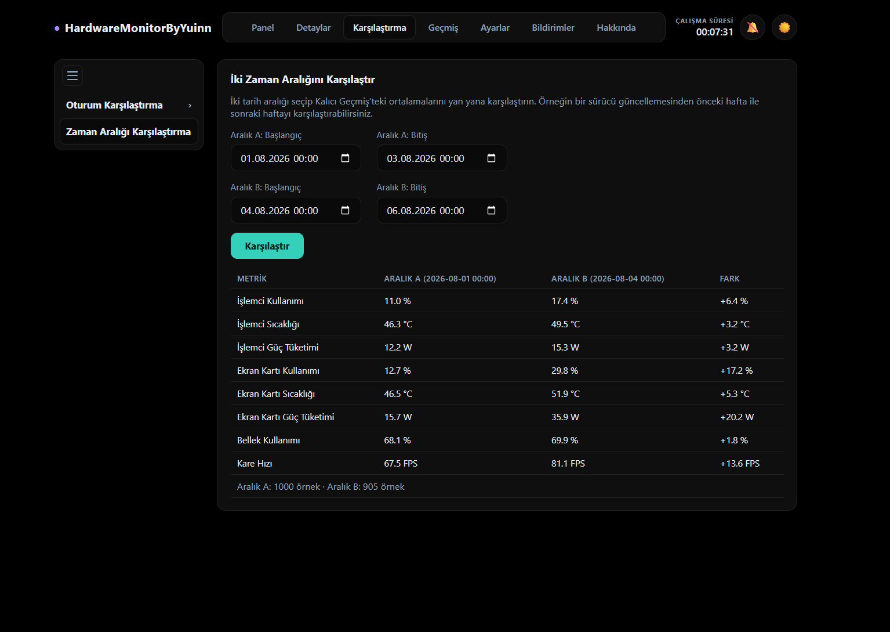
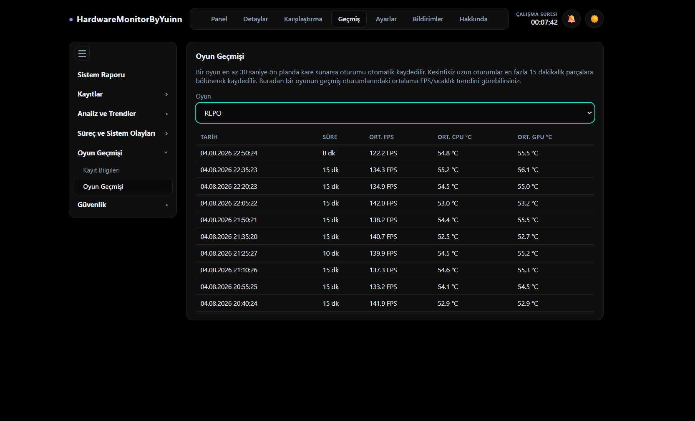
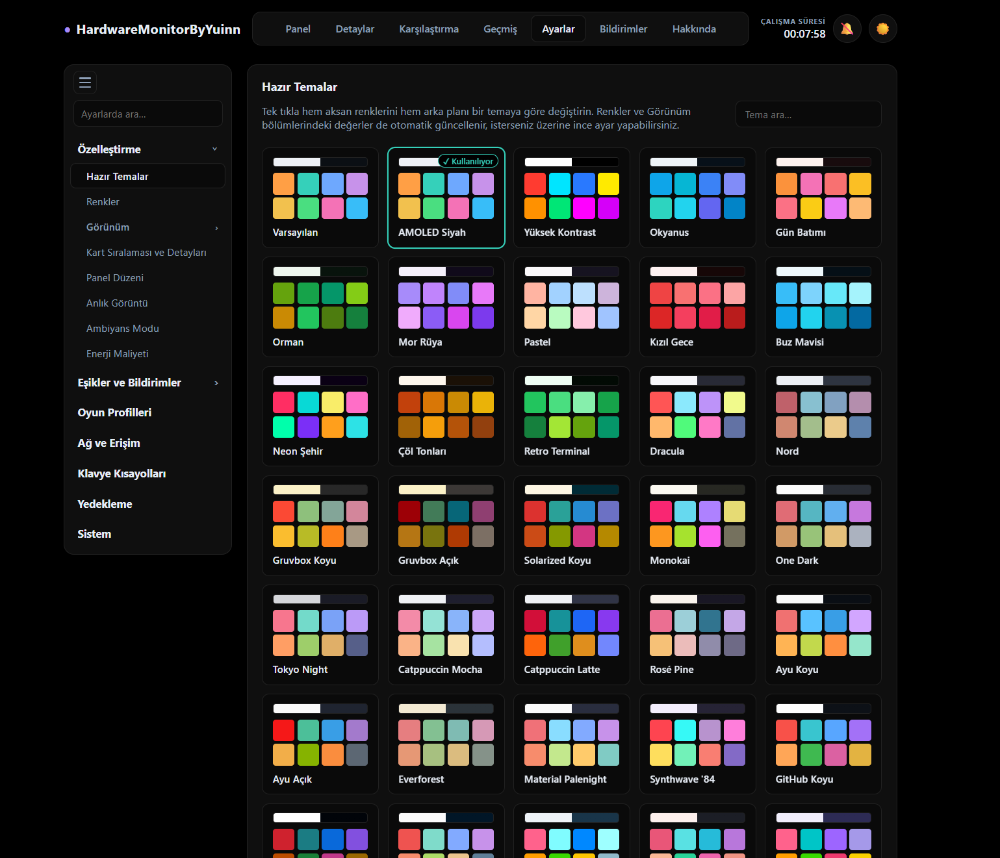
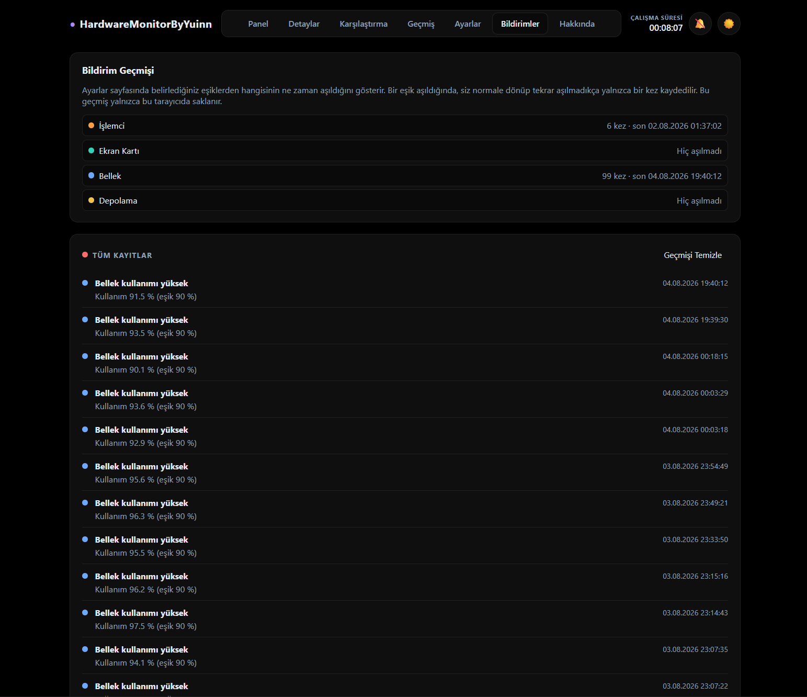
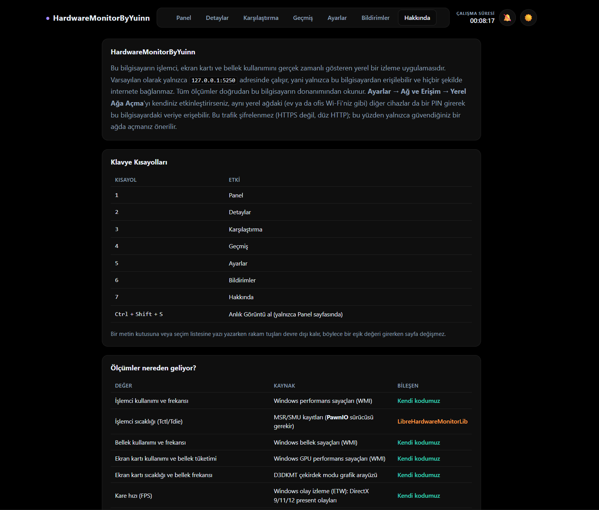

# HardwareMonitorByYuinn

A hardware monitoring app for Windows. It runs in the background as an ASP.NET Core
service and streams data in real time over SignalR; the interface opens in its own
desktop window (WebView2-based), so no separate browser tab is needed. The optional
**Local Network Access** feature (enabled from Settings) also lets another device on
the same network (phone, second computer) reach the dashboard through its browser,
protected by a PIN. The goal is to show the kind of information tools like
HWiNFO/AIDA64 collect, in a clean and customizable interface.

Most CPU, GPU, memory, disk, and network data is read directly from Windows' own
interfaces (WMI performance counters, D3DKMT, ETW). For vendor-specific values (GPU
core/hotspot temperature, RAM SPD info, SMART disk health, and similar),
LibreHardwareMonitorLib and a few small additional libraries are used; all of them
are distributed unmodified, in compiled form (see `LICENSES.txt`).

## Screenshots

**Dashboard**: real-time CPU/GPU/RAM/disk/network cards, resource usage, and a live chart.


**Details**: per-metric averages over several time windows.


**Comparison**: compare two time ranges side by side.


**History**: per-game session history with average FPS and temperature.


**Settings**: built-in theme presets.


**Notifications**: threshold alert history.


**About**: measurement sources and keyboard shortcuts.


## Features

- Real-time CPU / GPU / RAM / disk / network cards with threshold-based coloring
  (caution/critical levels)
- Persistent history logging with CSV/JSON export
- Game profiles: automatic detection by process name, per-game panel layout, and
  automatic snapshots
- FPS tracking (via ETW), 1% / 0.1% low, and frame time graph
- Heatmap and per-game history comparison
- SMART disk health, system event timeline (Windows Event Log), basic
  anomaly/memory-leak detection
- Overall system health summary on startup (0-100 score)
- Panel card visibility and drag-and-drop ordering, multiple layout profiles
- Built-in theme packs, glass effect, compact/normal/detailed density modes
- PIN-protected local network access: reach the panel from another device on the
  same network (phone, second monitor)
- System tray icon (Show/Exit); the window's close button can be set to minimize
  to tray or close directly (Settings → System)
- Auto-start on Windows startup (via Task Scheduler), optionally starting directly
  in the system tray without showing the window
- A loading screen with a progress bar on startup
- Window border/title bar matches the active theme's background color

## Technology

- .NET 10 / ASP.NET Core, SignalR
- Microsoft.Web.WebView2 (desktop window)
- Microsoft.Data.Sqlite (for persistent history)
- LibreHardwareMonitorLib, DiskInfoToolkit, RAMSPDToolkit (hardware reading)
- Microsoft.Diagnostics.Tracing.TraceEvent (FPS measurement via ETW)
- Plain JavaScript/CSS: no extra framework on the client side

The project is split into `Business` / `DataAccess` / `Entity` / `Web` layers.

## Requirements

- Windows 10/11 (relies on Windows-specific interfaces like WMI, D3DKMT, and ETW,
  so it doesn't run on other operating systems)
- .NET 10 SDK to build
- Some sensors (especially ETW-based FPS measurement and some hardware counters)
  may require administrator rights
- Microsoft Edge WebView2 Runtime: already installed on virtually all Windows
  10/11 machines (ships with Edge); if missing, the app silently installs it on
  first launch (one-time, needs internet)

## Running it

### Prebuilt release (no installation)

If you don't want to build from source, download the latest
`HardwareMonitorByYuinn-win-x64.zip` from the
[Releases](https://github.com/yusufemreshn/HardwareMonitorByYuinn/releases) page,
extract it to a folder, and run `HardwareMonitorByYuinn.Web.exe`. The app opens in
its own window (not a browser tab). It's a self-contained build, so no separate
.NET installation is required.

### From source

```
git clone https://github.com/yusufemreshn/HardwareMonitorByYuinn.git
cd HardwareMonitorByYuinn
dotnet build
dotnet run --project HardwareMonitorByYuinn.Web
```

When started with `dotnet run` (development environment) the window doesn't open
automatically; the server listens on `http://127.0.0.1:5250`, and you'll need to
open it manually in a browser. The desktop window only opens during normal use of
the compiled `.exe`. Local network access and PIN protection can be enabled from
the Settings tab.

Persistent history data (`history.db`, game sessions, process samples, login
attempts) is kept as separate SQLite files under
`%LOCALAPPDATA%\HardwareMonitorByYuinn\`, independent of the project folder itself.

## License

The source code in this repository is under the
[PolyForm Noncommercial License 1.0.0](https://polyformproject.org/licenses/noncommercial/1.0.0)
(see `LICENSE`); personal/noncommercial use, review, and contribution are allowed,
**commercial use is prohibited**. Third-party libraries distributed with the app
(including LibreHardwareMonitorLib, most of them under the Mozilla Public License
2.0) are subject to their own license terms; see `LICENSES.txt` for the full list
and details.

---

## Türkçe

Windows için bir donanım izleme uygulaması. Arka planda bir ASP.NET Core servisi olarak
çalışır, verileri SignalR ile gerçek zamanlı aktarır; arayüz kendi masaüstü penceresinde
(WebView2 tabanlı) açılır, ayrı bir tarayıcı sekmesi gerekmez. Ayarlar'dan açılabilen
**Yerel Ağa Açma** özelliğiyle aynı ağdaki başka bir cihazın (telefon, ikinci bilgisayar)
tarayıcısından da PIN korumalı erişilebilir. Amaç, HWiNFO/AIDA64 gibi araçların topladığı
bilgiyi sade ve özelleştirilebilir bir arayüzde göstermek.

İşlemci, ekran kartı, bellek, disk ve ağ verilerinin büyük kısmı Windows'un kendi
arayüzlerinden (WMI performans sayaçları, D3DKMT, ETW) doğrudan okunur. Üretici bazlı
değerler (GPU çekirdek gücü/hotspot sıcaklığı, RAM SPD bilgisi, SMART disk sağlığı gibi)
için LibreHardwareMonitorLib ve birkaç küçük ek kütüphane kullanılır; bunların hepsi
değiştirilmeden, derlenmiş haliyle dağıtılır (bkz. `LICENSES.txt`).

### Ekran Görüntüleri

**Panel**: gerçek zamanlı CPU/GPU/RAM/disk/ağ kartları, kaynak kullanımı ve canlı grafik.


**Detaylar**: birden fazla zaman aralığındaki metrik ortalamaları.


**Karşılaştırma**: iki zaman aralığını yan yana karşılaştırma.


**Geçmiş**: ortalama FPS ve sıcaklıkla birlikte oyun bazlı oturum geçmişi.


**Ayarlar**: hazır tema paketleri.


**Bildirimler**: eşik aşım geçmişi.


**Hakkında**: ölçüm kaynakları ve klavye kısayolları.


### Özellikler

- Gerçek zamanlı CPU / GPU / RAM / disk / ağ kartları, eşik bazlı renklendirme
  (dikkat/kritik seviyeleri)
- Kalıcı geçmiş kaydı ve CSV/JSON dışa aktarma
- Oyun profilleri: işlem adına göre otomatik algılama, oyuna özel panel düzeni ve
  otomatik anlık görüntü
- FPS takibi (ETW üzerinden), %1 / %0.1 low ve kare süresi grafiği
- Isı haritası ve oyun bazlı geçmiş karşılaştırma
- SMART disk sağlığı, sistem olayı zaman çizelgesi (Windows Event Log), basit
  anomali/bellek sızıntısı tespiti
- Açılışta genel sistem sağlığı özeti (0-100 puan)
- Panel kartlarının görünürlüğü ve sürükle-bırak sıralaması, birden fazla düzen profili
- Hazır tema paketleri, cam efekti, kompakt/normal/detaylı yoğunluk modları
- PIN korumalı yerel ağa açma: aynı ağdaki başka bir cihazdan (telefon, ikinci monitör)
  panele erişim
- Sistem tepsisi simgesi (Göster/Çıkış); pencerenin kapat düğmesi tepsiye küçültme ya da
  doğrudan kapatma arasında ayarlanabilir (Ayarlar → Sistem)
- Windows açılışında otomatik başlatma (Görev Zamanlayıcı üzerinden), isteğe bağlı olarak
  pencereyi hiç göstermeden doğrudan sistem tepsisinde başlatma
- Açılışta ilerleme çubuklu bir yükleme ekranı
- Pencere kenarlığı/başlık çubuğu aktif temanın arka plan rengiyle uyumlu

### Teknoloji

- .NET 10 / ASP.NET Core, SignalR
- Microsoft.Web.WebView2 (masaüstü penceresi)
- Microsoft.Data.Sqlite (kalıcı geçmiş için)
- LibreHardwareMonitorLib, DiskInfoToolkit, RAMSPDToolkit (donanım okuma)
- Microsoft.Diagnostics.Tracing.TraceEvent (ETW üzerinden FPS ölçümü)
- Sade JavaScript/CSS: istemci tarafında ek bir framework yok

Proje `Business` / `DataAccess` / `Entity` / `Web` katmanlarına ayrılmıştır.

### Gereksinimler

- Windows 10/11 (WMI, D3DKMT ve ETW gibi Windows'a özgü arayüzler kullanıldığı için
  başka bir işletim sisteminde çalışmaz)
- Derlemek için .NET 10 SDK
- Bazı sensörler (özellikle ETW tabanlı FPS ölçümü ve bazı donanım sayaçları) yönetici
  yetkisi gerektirebilir
- Microsoft Edge WebView2 Runtime: neredeyse tüm Windows 10/11 makinelerinde zaten
  kurulu gelir (Edge ile birlikte); yoksa uygulama ilk açılışta kendisi sessizce kurar
  (bir kereye mahsus, internet gerektirir)

### Çalıştırma

#### Hazır derleme (kurulum yapmadan)

Kaynak koddan derlemek istemiyorsan [Releases](https://github.com/yusufemreshn/HardwareMonitorByYuinn/releases)
sayfasından en güncel `HardwareMonitorByYuinn-win-x64.zip` dosyasını indir, bir klasöre
çıkart ve `HardwareMonitorByYuinn.Web.exe`'yi çalıştır. Uygulama kendi penceresinde açılır
(tarayıcı sekmesi değil). Self-contained bir derlemedir, ayrıca .NET kurulumu gerekmez.

#### Kaynak koddan

```
git clone https://github.com/yusufemreshn/HardwareMonitorByYuinn.git
cd HardwareMonitorByYuinn
dotnet build
dotnet run --project HardwareMonitorByYuinn.Web
```

`dotnet run` ile başlatıldığında (geliştirme ortamı) pencere otomatik açılmaz; sunucu
`http://127.0.0.1:5250` adresinde dinler, tarayıcıdan elle açman gerekir. Masaüstü
penceresi yalnızca derlenmiş `.exe`'nin normal kullanımında açılır. Yerel ağa açma ve
PIN koruması Ayarlar sekmesinden etkinleştirilebilir.

Kalıcı geçmiş verileri (`history.db`, oyun oturumları, process örnekleri, giriş
denemeleri) `%LOCALAPPDATA%\HardwareMonitorByYuinn\` altında ayrı SQLite dosyaları
olarak tutulur; proje klasörünün kendisiyle bir ilgisi yoktur.

### Lisans

Bu depodaki kaynak kod [PolyForm Noncommercial License 1.0.0](https://polyformproject.org/licenses/noncommercial/1.0.0)
altındadır (bkz. `LICENSE`); kişisel/ticari olmayan kullanım, inceleme ve katkı
serbesttir, **ticari kullanım yasaktır**. Uygulamayla birlikte dağıtılan üçüncü
taraf kütüphaneler (LibreHardwareMonitorLib dahil, çoğunluğu Mozilla Public
License 2.0) kendi lisans koşullarına tabidir; tam liste ve ayrıntılar için
`LICENSES.txt` dosyasına bakın.
